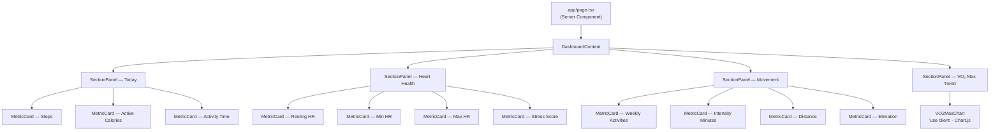
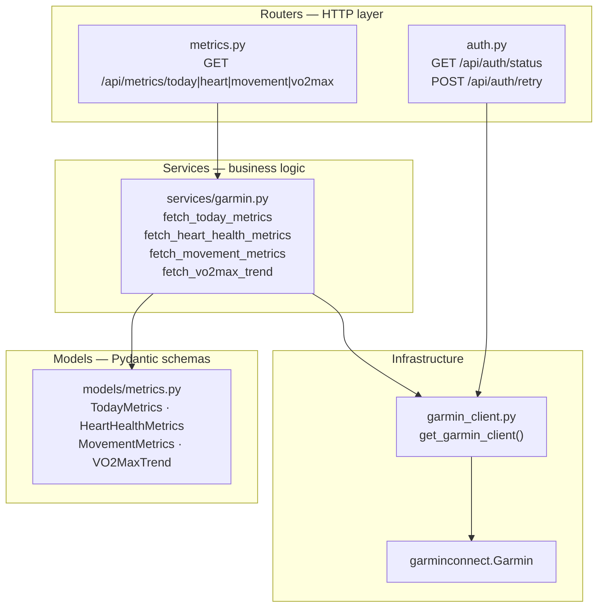
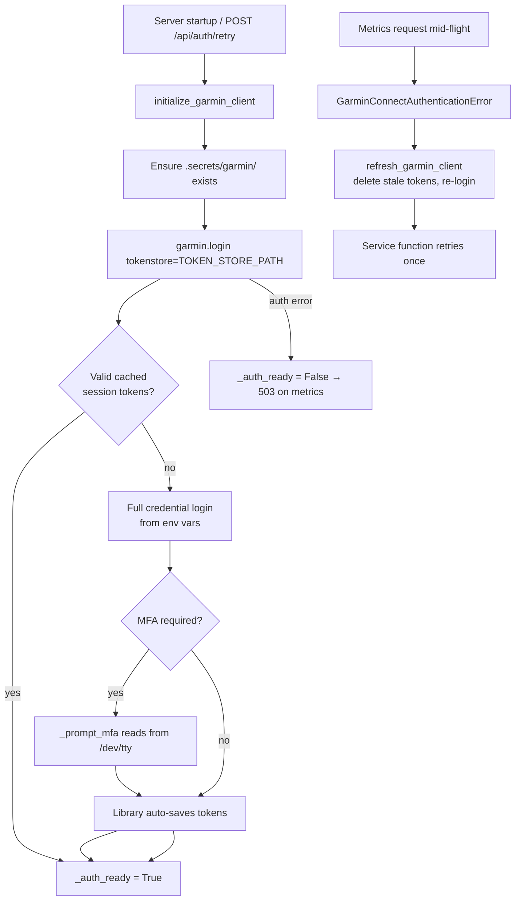
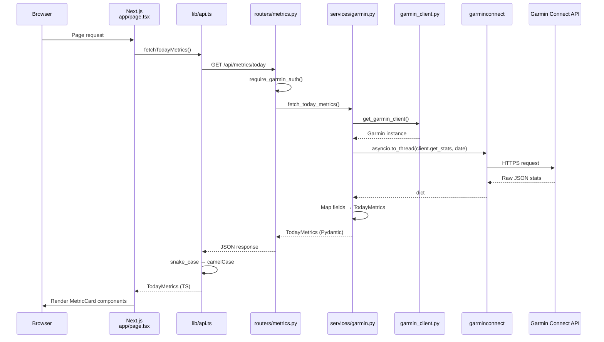

# Health Dashboard — Architecture

## Overview

Health Dashboard is a personal health monitoring application that pulls data from Garmin Connect and presents it in a single-page dashboard. The system is split into two services:

- **Backend** — a FastAPI application that authenticates with Garmin Connect via the `garminconnect` Python library, normalizes raw Garmin responses into typed Pydantic models, and exposes them as a REST API.
- **Frontend** — a Next.js 14 App Router application that fetches metrics from the backend at render time (server component) and displays them using a small set of dashboard-specific React components styled with Tailwind CSS.

Garmin credentials are loaded from environment variables (see `.env.example`); session tokens are cached locally under `.secrets/garmin/`. The frontend talks to the backend through `NEXT_PUBLIC_API_URL` (default `http://localhost:8000`).

### Security

This document describes architecture only — it must **never** contain real credentials, token values, MFA codes, or personal health data.

| Asset | Location | Rule |
|---|---|---|
| Garmin email/password | `backend/.env` | Git-ignored; copy from `.env.example`, fill locally |
| Session tokens | `.secrets/garmin/` | Git-ignored; treat like credentials |
| Frontend API URL | `.env.local` | Git-ignored; safe to default to localhost in dev |

**Deployment assumptions.** The backend REST API has no application-level user authentication — access control relies on network placement (localhost or a trusted private network). Metrics and auth endpoints (`/api/metrics/*`, `/api/auth/*`) return personal health data and must not be exposed to the public internet without adding authentication and TLS.

**API responses.** Routers return typed Pydantic models only; Garmin credentials and raw session tokens are never included in JSON responses. Error messages should stay generic in production to avoid leaking internal details.

**Documentation.** Refer to env var *names* and directory paths only — never paste values from `.env`, `.secrets/`, or live API responses into issues, commits, or docs.

---

## System Diagram

```mermaid
flowchart LR
    GC[Garmin Connect API]
    LIB[garminconnect library]
    GC --> LIB

    subgraph Backend["FastAPI Backend"]
        GC_CLIENT[garmin_client.py<br/>singleton + token store]
        SVC[services/garmin.py<br/>business logic]
        MDL[models/metrics.py<br/>Pydantic schemas]
        RTR[routers/<br/>metrics.py · auth.py]
        LIB --> GC_CLIENT
        GC_CLIENT --> SVC
        SVC --> MDL
        MDL --> RTR
    end

    REST[REST API<br/>/api/metrics/* · /api/auth/*]
    RTR --> REST

    subgraph Frontend["Next.js Frontend"]
        API[lib/api.ts<br/>fetch helpers]
        PAGE[app/page.tsx<br/>Server Component]
        COMP[components/dashboard/<br/>SectionPanel · MetricCard · VO2MaxChart]
        API --> PAGE
        PAGE --> COMP
    end

    REST --> API
```

---

## Frontend Architecture

### Directory layout

| Path | Role |
|---|---|
| `app/page.tsx` | Dashboard entry point — server component that fetches all metrics and composes the UI |
| `app/layout.tsx` | Root layout, fonts, global styles |
| `lib/api.ts` | All HTTP calls to the backend; maps snake_case JSON to camelCase TypeScript types |
| `types/dashboard.ts` | Shared TypeScript interfaces for metric data and component props |
| `components/dashboard/` | Dashboard-specific UI: `SectionPanel`, `MetricCard`, `VO2MaxChart` |

There is no `components/ui/` directory yet; generic primitives would go there when needed.

### Component hierarchy

`app/page.tsx` renders a `DashboardContent` helper that lays out four `SectionPanel` sections. Three sections contain `MetricCard` children; the VO₂ Max section contains a single `VO2MaxChart`.

**`SectionPanel`** — a card wrapper with a titled header and a responsive CSS grid (`columns` prop: 1–4). Props are typed in `types/dashboard.ts`.

**`MetricCard`** — displays a label, formatted value (with optional unit), and an optional progress bar. Uses Midnight Terminal accent tokens (`text-accent-green`, `text-accent-blue`, `text-accent-coral`) and `font-mono-display` for numeric values.

**`VO2MaxChart`** — the only client component in the dashboard. It receives a `VO2MaxTrend` prop and renders a Chart.js line chart with a crosshair plugin and custom HTML tooltip. Shows an empty state when no history is available.

### Data flow (fetch → render)

1. **`Home`** (default export in `app/page.tsx`) is an async server component. On each request it calls four fetch helpers in parallel via `Promise.all`:
   - `fetchTodayMetrics()` → `/api/metrics/today`
   - `fetchHeartHealthMetrics()` → `/api/metrics/heart`
   - `fetchMovementMetrics()` → `/api/metrics/movement`
   - `fetchVO2MaxTrend()` → `/api/metrics/vo2max`

2. **`lib/api.ts`** wraps every call in `apiFetch()`, which reads `NEXT_PUBLIC_API_URL`, sends a GET request, and sets `next: { revalidate: 300 }` so Next.js caches responses for five minutes.

3. Each fetch helper maps the backend's snake_case JSON to camelCase frontend types defined in `types/dashboard.ts`. On failure, the helper logs the error and returns a safe default object so a single endpoint outage does not crash the page.

4. Resolved data is passed as props to **`DashboardContent`**, which renders `MetricCard` and `VO2MaxChart` instances inside their respective `SectionPanel` sections. No component performs its own fetch — all data arrives top-down from the page.

5. If the outer `try/catch` in `Home` catches an unexpected error, the page renders a centered error card instead of the dashboard.

### Adding a new metric card

To display a new scalar metric inside an existing section:

1. **`backend/app/models/metrics.py`** — add the field to the relevant Pydantic model (or create a new model).
2. **`backend/app/services/garmin.py`** — populate the field from the appropriate `garminconnect` client method inside the matching `fetch_*` function.
3. **`types/dashboard.ts`** — add the corresponding camelCase field to the frontend interface.
4. **`lib/api.ts`** — update the raw interface and mapping in the fetch helper.
5. **`app/page.tsx`** — add a `<MetricCard>` inside the appropriate `<SectionPanel>`, wiring the new prop.

To add an entirely new section (e.g. a "Body Composition" panel):

1. Follow steps 1–2 above with a new Pydantic model and service function.
2. Add a new router endpoint in **`backend/app/routers/metrics.py`**.
3. Add frontend types, a fetch helper, and a new `<SectionPanel>` block in `app/page.tsx`.
4. If the visualization is more complex than a scalar (like VO₂ Max), create a new component in **`components/dashboard/`** and use `'use client'` only if it needs browser APIs or interactivity.

---

## Backend Architecture

### Directory layout

| Path | Role |
|---|---|
| `app/main.py` | FastAPI app factory, CORS, router registration, startup auth hook |
| `app/config.py` | `pydantic-settings` config (Garmin credentials from env); defines `TOKEN_STORE_PATH` |
| `app/garmin_client.py` | Garmin singleton, login/token persistence, MFA prompt, rate-limit backoff |
| `app/routers/metrics.py` | HTTP endpoints under `/api/metrics/*` |
| `app/routers/auth.py` | Auth status and retry endpoints under `/api/auth/*` |
| `app/services/garmin.py` | Business logic — calls `garminconnect` methods, maps to Pydantic models |
| `app/models/metrics.py` | Pydantic response schemas (snake_case fields) |

### Layered structure

**Routers** validate that Garmin auth is ready (via the `require_garmin_auth` dependency on the metrics router), delegate to service functions, and return typed Pydantic models. Errors from Garmin are surfaced as HTTP 502; missing auth returns 503.

**Services** contain all Garmin-specific logic. Each `fetch_*` function is decorated with `@_with_auth_retry`, which catches `GarminConnectAuthenticationError`, calls `refresh_garmin_client()`, and retries once. Blocking `garminconnect` calls run in a thread pool via `asyncio.to_thread`.

**Models** define the JSON contract. Field names use snake_case to match Python conventions; the frontend maps them to camelCase in `lib/api.ts`.

### Authentication flow

Key details:

- **`garmin_client.py`** holds a module-level singleton (`_client`, `_auth_ready`). All service functions obtain the client through `get_garmin_client()`, which raises `GarminNotAuthenticatedError` when auth is not ready.
- **Token persistence** — session tokens are stored under `<project_root>/.secrets/garmin/` (git-ignored). On startup, `garminconnect` tries to restore from the token store before falling back to credentials. After a successful login, tokens are saved automatically. Do not commit or copy token files into documentation.
- **MFA** — when Garmin requires multi-factor authentication, the library invokes `_prompt_mfa`, which reads a 6-digit code from `/dev/tty` (falls back to `input()` on platforms without it). This runs on a worker thread so the async event loop is not blocked.
- **Rate limiting** — `_login_with_backoff` applies exponential backoff (60 s base, 3 attempts) when all five of the library's login strategies return HTTP 429.
- **Graceful degradation** — if startup auth fails, the server still starts. Metrics endpoints return 503 until `POST /api/auth/retry` succeeds. `GET /api/auth/status` reports the current state without triggering a login.

### Adding a new data source or endpoint

1. **`app/models/metrics.py`** — define a new Pydantic `BaseModel` for the response shape.
2. **`app/services/garmin.py`** — implement an async `fetch_*` function that:
   - calls the appropriate `garminconnect` client method via `asyncio.to_thread`
   - maps the raw dict response into the Pydantic model
   - is decorated with `@_with_auth_retry`
3. **`app/routers/metrics.py`** — add a `GET` route with `response_model=YourModel`, calling the new service function and wrapping errors in `HTTPException(502)`.
4. On the frontend, add types, a fetch helper, and UI as described in the frontend section above.

If the data source is not Garmin (e.g. a manual CSV import or a different wearable API), create a new service module under `app/services/` and optionally a new router. The existing `garmin_client` singleton and auth flow remain unchanged.

---

## Data Flow

End-to-end path for a single metrics request (e.g. `GET /api/metrics/today`):

The same pattern applies to the other three endpoints, with different `garminconnect` methods (`get_heart_rates`, `get_activities_by_date`, `get_max_metrics`) and different Pydantic models.

---

## Extensibility

The architecture separates concerns so new health metrics or entirely new data sources can be added without restructuring existing code.

### What stays unchanged

| Layer | Stable contracts |
|---|---|
| `garmin_client.py` | Singleton auth, token store, MFA, retry — shared by all Garmin-backed services |
| `app/main.py` | App wiring, CORS, startup hook |
| `app/config.py` | Environment variable loading |
| `SectionPanel`, `MetricCard` | Generic display components — no metric-specific logic |
| `lib/api.ts` `apiFetch()` | Generic fetch wrapper with caching |
| Auth router | `/api/auth/status` and `/api/auth/retry` are source-agnostic |

### What gets new code per metric or source

| Layer | New code needed | Example (adding weight tracking) |
|---|---|---|
| **Pydantic model** | New or extended schema in `models/metrics.py` | `BodyCompositionMetrics` with `weight_kg: float` |
| **Service** | New `fetch_*` function in `services/garmin.py` (or a new service file for non-Garmin sources) | Call `client.get_body_composition(date)` and map fields |
| **Router** | New `GET` endpoint in `routers/metrics.py` | `@router.get("/body", response_model=BodyCompositionMetrics)` |
| **Frontend type** | New interface in `types/dashboard.ts` | `BodyCompositionMetrics { weight: number \| null }` |
| **API helper** | New function in `lib/api.ts` | `fetchBodyCompositionMetrics()` with snake_case mapping |
| **UI** | New `SectionPanel` + `MetricCard`(s) or a dedicated chart component in `app/page.tsx` | "Body Composition" panel with a weight card |

### Accommodating non-Garmin sources

For metrics Garmin does not provide (blood pressure, glucose, etc.), the same layering applies:

1. Add a new service module (e.g. `app/services/manual.py` or `app/services/withings.py`) that implements the same `@_with_auth_retry`-style error handling pattern but calls a different API or reads from a local store.
2. Register a new router (or extend the metrics router) pointing at the new service.
3. Add frontend types, fetch helper, and UI components following the same pattern.

The frontend never imports Garmin-specific code — it only knows about REST endpoints and TypeScript types — so swapping or adding backends does not require changes to `MetricCard` or `SectionPanel`.

### Visualization beyond scalar cards

When a metric needs a chart (like VO₂ Max), create a new component in `components/dashboard/`. Mark it `'use client'` only if it requires browser APIs (Chart.js, interactivity). Define its prop types either in `types/dashboard.ts` or co-located with the API response type in `lib/api.ts` (as `VO2MaxTrend` is today). The page server component fetches the data and passes it as props — the chart component does not fetch.
